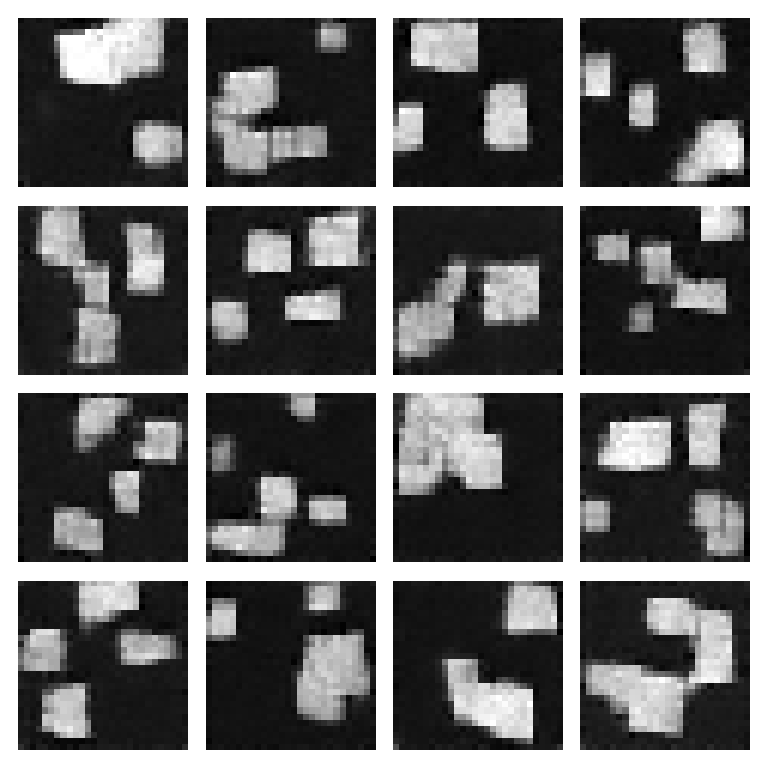
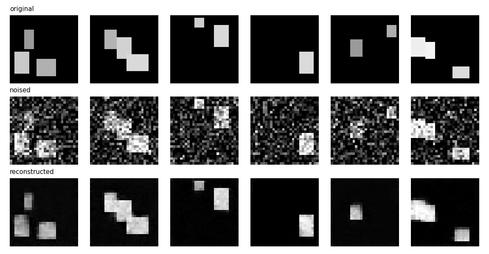

# 🌫️ Diffusion Model for Image Reconstruction


A compact, from-scratch implementation of a **Denoising Diffusion Probabilistic
Model (DDPM)** — Ho et al. (2020) — for image generation and reconstruction.
Everything is small enough to **train on a CPU in ~1 minute** and runs fully
offline on a bundled synthetic dataset.

## ✨ Results

Trained for 12 epochs on synthetic shapes (CPU, ~75s):

**Generated samples** — pure noise → images via the reverse diffusion chain:



**Reconstruction** — a real image is noised to step *t*=80, then the model
denoises it back, recovering the structure:



## 🧠 How it works

| Piece | File | Role |
| ----- | ---- | ---- |
| **Forward process** | `ddpm.py` | A fixed linear β-schedule progressively adds Gaussian noise; `q_sample` gives `x_t` from `x_0` in closed form. |
| **Noise predictor** | `unet.py` | A small time-conditioned **U-Net** (2 down/up stages, skip connections, sinusoidal timestep embedding) predicts the noise ε. |
| **Training** | `ddpm.py` / `train.py` | Minimise MSE between true and predicted noise (the ε-prediction objective). |
| **Sampling** | `ddpm.py` | Ancestral sampler runs the reverse chain from pure noise to an image. |
| **Reconstruction** | `ddpm.py` | Noise a real image to step *t*, then denoise back — partial noising controls how much structure is kept. |

## 🗂️ Structure

```
diffusion-model-reconstruction/
├── src/diffusion/
│   ├── unet.py          # time-conditioned U-Net (ε-prediction)
│   ├── ddpm.py          # GaussianDiffusion: schedule, q_sample, p_sample, sample, reconstruct
│   ├── data.py          # offline synthetic shapes dataset
│   ├── train.py         # training loop
│   ├── sample.py        # generate a grid of samples
│   └── reconstruct.py   # original | noised | reconstructed triptych
├── tests/               # U-Net + DDPM maths/shape tests (pytest)
├── assets/              # example outputs (shown above)
├── pyproject.toml
└── requirements.txt
```

## 🚀 Quickstart

```bash
pip install -r requirements.txt
pip install -e .

# Train (writes models/ddpm.pt)
python -m diffusion.train --epochs 20 --timesteps 200

# Generate samples
python -m diffusion.sample --n 16 --out outputs/samples.png

# Reconstruct images (noise to t, then denoise back)
python -m diffusion.reconstruct --t-start 80 --out outputs/reconstruction.png

# Run the tests
pytest
```

### Use the components directly

```python
import torch
from diffusion import UNet, GaussianDiffusion

model = UNet()
diffusion = GaussianDiffusion(timesteps=200)

x0 = torch.randn(8, 1, 28, 28)
t = torch.randint(0, 200, (8,))
loss = diffusion.p_losses(model, x0, t)   # training objective
images = diffusion.sample(model, (4, 1, 28, 28))  # generate
```

## 📊 Data

The bundled `SyntheticShapes` dataset draws a few bright rectangles on a dark
28×28 canvas — enough structure to learn and reconstruct, with **no downloads**.
To train on real images, swap it for e.g. `torchvision.datasets.MNIST`; the U-Net
and diffusion code are unchanged (single channel, 28×28).

## 🎯 What this project demonstrates

The full diffusion stack implemented from first principles: the variance
schedule and closed-form forward process, a U-Net ε-predictor with timestep
conditioning, the training objective, ancestral sampling, and partial-noising
reconstruction — with tests and reproducible, CPU-friendly results.

## 📜 License

MIT — see [`LICENSE`](LICENSE).
